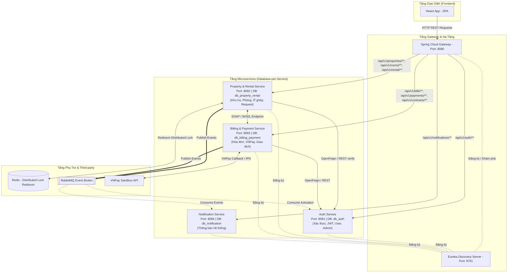
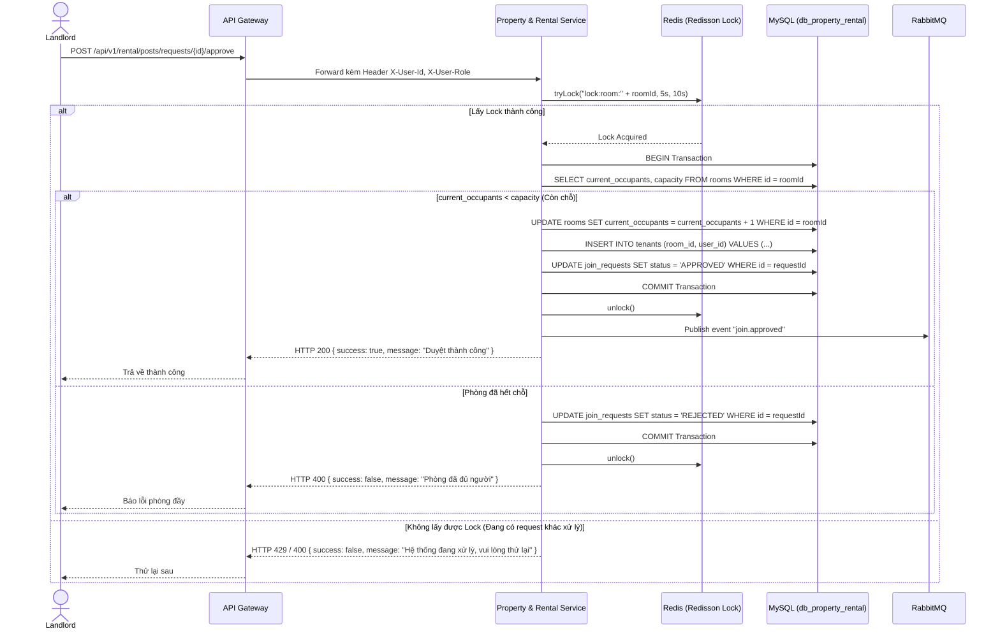

# TÀI LIỆU TOÀN DIỆN VỀ DỰ ÁN & KIẾN TRÚC HỆ THỐNG
# NỀN TẢNG TÌM KIẾM, CHO THUÊ PHÒNG TRỌ & KẾT NỐI NGƯỜI Ở GHÉP (ROOMILY MICROSERVICES)

---

## 📖 I. MÔ TẢ TỔNG QUAN DỰ ÁN (PROJECT OVERVIEW)

### 1. Website này là gì?
Chúng ta đang xây dựng một **website trung gian kết nối chủ trọ và người thuê phòng**, hoạt động tương tự như một sàn bất động sản mini nhưng tập trung chuyên sâu vào phân khúc **phòng trọ bình dân** – đối tượng phục vụ chủ yếu là sinh viên và người đi làm xa nhà.

Dự án giải quyết 2 bài toán thực tế nhức nhối:
1. **Tìm kiếm phòng trọ minh bạch, tiện lợi:** Thay vì phải lang thang tìm kiếm trên các hội nhóm mạng xã hội đầy rủi ro hoặc đi dò hỏi từng ngõ ngách, người dùng có thể truy cập website để tìm kiếm phòng ngay, lọc đa tiêu chí (giá cả, diện tích, khu vực quận/phường, tiện ích đi kèm...) và gửi yêu cầu thuê phòng trực tiếp tới chủ trọ.
2. **Tìm người ở ghép & tối ưu chi phí:** Rất nhiều phòng trọ có sức chứa 2–3 người nhưng chỉ có 1 người đang ở (gây lãng phí chi phí thuê). Nền tảng cho phép người đang thuê **đăng bài tìm bạn ở cùng** để share tiền phòng; người có nhu cầu ở ghép có thể gửi yêu cầu tham gia để chủ trọ kiểm duyệt.

---

### 2. Ba Nhóm Người Dùng (3 Actors/Roles)

#### 🛡️ 1. ADMIN – Quản trị viên hệ thống
* **Vai trò:** Người quản lý và vận hành toàn bộ website. Admin không tham gia đăng/thuê phòng mà chịu trách nhiệm giữ gìn hệ thống sạch sẽ, an toàn, minh bạch.
* **Hành vi chính:**
  * Đăng nhập trang quản trị riêng (**Admin Dashboard**).
  * Giám sát số liệu tổng quan toàn sàn: số lượng User đăng ký, số Chủ trọ đang hoạt động, tổng số khu trọ/phòng trọ trên hệ thống, các giao dịch thanh toán kích hoạt tài khoản.
  * Quản lý & xử lý vi phạm: Khóa/mở khóa tài khoản người dùng hoặc chủ trọ nếu có dấu hiệu gian lận, spam, lừa đảo.
  * Quản lý danh sách chủ trọ đang chờ kích hoạt.

#### 🏠 2. LANDLORD – Chủ trọ
* **Vai trò:** Người kinh doanh cho thuê phòng. Để hạn chế tài khoản ảo, chủ trọ cần đăng ký và kích hoạt tài khoản thông qua cổng thanh toán VNPay Sandbox.
* **Hành trình trải nghiệm:**
  1. **Đăng ký & Kích hoạt:** Điền thông tin cá nhân (Họ tên, SĐT, Email, CCCD) → Trạng thái `PENDING_PAYMENT` → Thanh toán phí kích hoạt qua VNPay Sandbox → Hệ thống tự động kích hoạt trạng thái `ACTIVE`.
  2. **Quản lý bất động sản & phòng:** Tạo khu trọ (tên, địa chỉ, tiện ích chung: wifi, máy giặt, bãi xe...) → Thêm từng phòng trọ (số phòng, giá thuê, diện tích, sức chứa, upload hình ảnh thực tế).
  3. **Kiểm duyệt yêu cầu thuê phòng:** Nhận thông báo khi có khách gửi yêu cầu thuê → Xem hồ sơ → Bấm **Duyệt** (hệ thống tự tạo hợp đồng, ghi nhận cư dân) hoặc **Từ chối**.
  4. **Kiểm duyệt yêu cầu ở ghép:** Xem và phê duyệt người mới xin vào ở ghép tại phòng của mình → Đảm bảo nắm rõ danh tính mọi cư dân đang cư trú.
  5. **Quản lý hợp đồng & xuất hóa đơn:** Quản lý danh sách hợp đồng thuê phòng, hàng tháng tạo hóa đơn tiền phòng/điện nước cho người thuê theo dõi.

#### 👤 3. USER – Người thuê phòng & Tìm ở ghép
* **Vai trò:** Sinh viên, người đi làm có nhu cầu tìm phòng hoặc share phòng.
* **Hành trình trải nghiệm:**
  1. **Đăng ký & Đăng nhập:** Đăng ký tài khoản nhanh chóng chỉ với Email, Mật khẩu, Tên, Số điện thoại.
  2. **Tìm kiếm phòng trọ:** Sử dụng bộ lọc thông minh (khu vực, tầm giá, diện tích, tiện ích) → Xem danh sách kết quả trực quan.
  3. **Xem chi tiết & Gửi yêu cầu thuê:** Xem bộ sưu tập ảnh, thông tin tiện ích, thông tin chủ trọ → Bấm **"Gửi yêu cầu thuê"** kèm lời nhắn.
  4. **Theo dõi trạng thái:** Theo dõi yêu cầu thuê (`PENDING` / `APPROVED` / `REJECTED`) → Khi được duyệt, nhận thông báo và xem hợp đồng thuê.
  5. **Tìm người ở ghép:**
     * *Nếu đang thuê phòng còn chỗ:* Tạo bài đăng tìm bạn ở ghép (nhập mô tả lối sống, giá chia).
     * *Nếu muốn tìm phòng ở ghép:* Vào mục "Ở ghép", xem các phòng còn chỗ trống, gửi yêu cầu xin tham gia kèm lời giới thiệu.
  6. **Theo dõi hóa đơn:** Hàng tháng nhận thông báo hóa đơn tiền nhà từ chủ trọ, xem hạn đóng và trạng thái thanh toán.

---

### 3. Điểm Nhấn Nghiệp Vụ & Kỹ Thuật Nổi Bật
1. **Chống tranh chấp chỗ ở (Concurrency Control với Redis Distributed Lock):**
   * *Bài toán:* Một phòng chỉ còn 1 chỗ trống duy nhất nhưng có nhiều yêu cầu ở ghép được gửi tới hoặc duyệt cùng lúc.
   * *Giải pháp:* Sử dụng **Redis Lock (Redisson) + Database Transaction + Optimistic Locking (`@Version`)** để đảm bảo tính tuần tự tuyệt đối (Atomic). Chỉ 1 người duy nhất được duyệt vào ở, các yêu cầu vượt quá sức chứa sẽ tự động bị từ chối an toàn.
2. **Tích hợp Cổng thanh toán VNPay Sandbox & Chuẩn hóa SOAP/WSDL:**
   * Tích hợp thanh toán sandbox cho quy trình kích hoạt tài khoản chủ trọ.
   * Cung cấp giao thức Web Service chuẩn **SOAP/WSDL** phục vụ tra cứu/xử lý giao dịch thanh toán chuẩn chỉ.
3. **Kiến trúc hướng sự kiện (Event-Driven Architecture với RabbitMQ):**
   * Tách biệt logic và xử lý bất đồng bộ các luồng: Kích hoạt tài khoản, Gửi thông báo hệ thống khi Duyệt thuê / Duyệt ở ghép / Tạo hóa đơn.
4. **Kiến trúc Microservices chuẩn mực:**
   * Chia nhỏ 4 domain độc lập, cơ sở dữ liệu riêng biệt (**Database-per-Service**), định tuyến tập trung qua **API Gateway** và phân giải qua **Eureka Discovery Server**.

---

### 4. Tóm Tắt Định Hướng Dự Án
> **"Xây dựng nền tảng trung gian hoàn chỉnh, tin cậy, giao diện hiện đại, logic nghiệp vụ chặt chẽ từ tìm kiếm, quản lý phòng, kiểm duyệt hợp đồng đến kết nối ở ghép — vận hành trên nền tảng Microservices Spring Boot & React."**

---

## 🏛️ II. THIẾT KẾ KIẾN TRÚC HỆ THỐNG (SYSTEM ARCHITECTURE)

### 1. Tổng Thể Mô Hình 4 Microservices

### 2. Bảng Phân Chia Dịch Vụ & Database (Database-per-Service)

| Service | Port | Database | Nhiệm vụ chính |
| :--- | :--- | :--- | :--- |
| **API Gateway** | `8080` | - | Entry point duy nhất, JWT Authentication Filter, Routing, CORS |
| **Eureka Server** | `8761` | - | Service Discovery & Registration Registry |
| **Auth Service** | `8081` | `db_auth` | Đăng ký, đăng nhập, cấp phát/validate JWT, Admin dashboard, Quản lý User/Landlord |
| **Property & Rental Service** | `8082` | `db_property_rental` | CRUD Khu trọ, Phòng trọ, Upload ảnh, Tìm kiếm/Lọc, Yêu cầu thuê, Ở ghép, Cư dân, Hợp đồng, Redis Lock |
| **Billing & Payment Service** | `8083` | `db_billing_payment` | Quản lý Hóa đơn, Giao dịch thanh toán VNPay, SOAP Web Service endpoint |
| **Notification Service** | `8084` | `db_notification` | Lắng nghe RabbitMQ messages → Lưu trữ và trả về danh sách thông báo người dùng |

---

### 3. Thiết Kế Cơ Sở Dữ Liệu Chi Tiết (12 Bảng)

#### 🗄️ 3.1. Database `db_auth`
* **Bảng `users`**:
  * `id` (BIGINT, PK, AI)
  * `email` (VARCHAR 100, Unique, Not Null)
  * `password` (VARCHAR 255, Not Null - BCrypt)
  * `full_name` (VARCHAR 100, Not Null)
  * `phone_number` (VARCHAR 20, Not Null)
  * `role` (VARCHAR 20, Not Null: `ADMIN`, `LANDLORD`, `USER`)
  * `status` (VARCHAR 20, Not Null: `PENDING_PAYMENT`, `ACTIVE`, `SUSPENDED`)
  * `id_card_number` (VARCHAR 20, Nullable - CCCD chủ trọ)
  * `created_at` (TIMESTAMP, Default NOW)

#### 🗄️ 3.2. Database `db_property_rental`
* **Bảng `properties` (Khu trọ):**
  * `id` (BIGINT, PK, AI), `landlord_id` (BIGINT, Index), `title` (VARCHAR 150), `description` (TEXT), `address` (VARCHAR 255), `city` (VARCHAR 100), `district` (VARCHAR 100), `ward` (VARCHAR 100), `utilities` (VARCHAR 500), `created_at` (TIMESTAMP).
* **Bảng `rooms` (Phòng trọ):**
  * `id` (BIGINT, PK, AI), `property_id` (BIGINT, FK), `room_number` (VARCHAR 20), `price` (DECIMAL 12,2), `area` (DECIMAL 5,2), `capacity` (INT), `current_occupants` (INT default 0), `status` (VARCHAR 20: `AVAILABLE`, `FULL`, `MAINTENANCE`), `version` (INT default 0 - Optimistic Lock).
* **Bảng `room_images` (Ảnh phòng):**
  * `id` (BIGINT, PK, AI), `room_id` (BIGINT, FK), `image_url` (VARCHAR 255).
* **Bảng `rental_requests` (Yêu cầu thuê phòng):**
  * `id` (BIGINT, PK, AI), `user_id` (BIGINT), `room_id` (BIGINT, Index), `note` (TEXT), `status` (VARCHAR 20: `PENDING`, `APPROVED`, `REJECTED`, `CANCELLED`), `created_at` (TIMESTAMP).
* **Bảng `tenants` (Người đang ở thực tế - Quan hệ cư trú):**
  * `id` (BIGINT, PK, AI), `room_id` (BIGINT, Index), `user_id` (BIGINT, Unique - 1 user chỉ ở 1 phòng), `joined_at` (TIMESTAMP).
* **Bảng `contracts` (Hợp đồng thuê):**
  * `id` (BIGINT, PK, AI), `landlord_id` (BIGINT), `tenant_id` (BIGINT), `room_id` (BIGINT), `start_date` (DATE), `end_date` (DATE), `rental_price` (DECIMAL 12,2), `deposit` (DECIMAL 12,2), `status` (VARCHAR 20: `ACTIVE`, `EXPIRED`, `TERMINATED`), `contract_url` (VARCHAR 255).
* **Bảng `roommate_posts` (Bài đăng tìm ở ghép):**
  * `id` (BIGINT, PK, AI), `room_id` (BIGINT, Unique), `creator_id` (BIGINT), `title` (VARCHAR 255), `description` (TEXT), `price_share` (DECIMAL 12,2), `status` (VARCHAR 20: `OPEN`, `FULL`, `CLOSED`), `created_at` (TIMESTAMP).
* **Bảng `join_requests` (Yêu cầu xin ở ghép):**
  * `id` (BIGINT, PK, AI), `post_id` (BIGINT, FK), `user_id` (BIGINT), `introduction` (TEXT), `status` (VARCHAR 20: `PENDING`, `APPROVED`, `REJECTED`, `CANCELLED`), `created_at` (TIMESTAMP).

#### 🗄️ 3.3. Database `db_billing_payment`
* **Bảng `invoices` (Hóa đơn phòng):**
  * `id` (BIGINT, PK, AI), `contract_id` (BIGINT, Index), `room_id` (BIGINT), `billing_cycle` (VARCHAR 10, VD `2026-08`), `room_amount` (DECIMAL 12,2), `electricity_amount` (DECIMAL 12,2), `water_amount` (DECIMAL 12,2), `service_amount` (DECIMAL 12,2), `total_amount` (DECIMAL 12,2), `due_date` (DATE), `status` (VARCHAR 20: `UNPAID`, `PAID`, `OVERDUE`), `created_at` (TIMESTAMP).
* **Bảng `transactions` (Lịch sử giao dịch):**
  * `id` (BIGINT, PK, AI), `txn_ref` (VARCHAR 100, Unique), `amount` (DECIMAL 12,2), `payment_type` (VARCHAR 50: `LANDLORD_REGISTRATION`, `INVOICE_PAYMENT`), `reference_id` (BIGINT), `vnp_transaction_no` (VARCHAR 100), `bank_code` (VARCHAR 20), `status` (VARCHAR 20: `PENDING`, `SUCCESS`, `FAILED`), `created_at` (TIMESTAMP), `completed_at` (TIMESTAMP).

#### 🗄️ 3.4. Database `db_notification`
* **Bảng `notifications`:**
  * `id` (BIGINT, PK, AI), `user_id` (BIGINT, Index), `title` (VARCHAR 255), `content` (TEXT), `is_read` (BOOLEAN default FALSE), `created_at` (TIMESTAMP).

---

### 4. Chi Tiết Luồng Concurrency Với Redisson Lock

---

## 👥 III. PHÂN CHIA TRÁCH NHIỆM TỔNG THỂ (RESPONSIBILITY MATRIX)

| Thành viên | Trọng tâm phụ trách | Khối lượng Backend | Khối lượng Frontend | Tích hợp & Hạ tầng |
| :--- | :--- | :--- | :--- | :--- |
| **🔵 HẢO** *(Nhóm trưởng)* | Hạ tầng Core + Module Ở ghép + Concurrency | Eureka, Gateway, JWT Filter, Roommate Post, Join Request, Redis Redisson Lock | UI Tìm & Đăng bài ở ghép, Modal xin tham gia, Script Test Race Condition | Docker Compose, Redisson Lock, Concurrency Benchmark |
| **🟢 HÙNG** | Xác thực + Đặt phòng + Admin + Notification | Auth Service (JWT, Login/Register), Rental Request CRUD & Duyệt, Admin Service, Notification Service | UI Login/Register/LandlordRegister, UI Duyệt yêu cầu thuê, Notification Bell component | RabbitMQ Listener kích hoạt tài khoản & tạo thông báo, OpenFeign client |
| **🟡 HUY** | Bất động sản + Tìm kiếm + SOAP Interface | Property CRUD, Room CRUD, Upload ảnh đa file, JPA Specification Search Engine, SOAP Service | UI Quản lý Khu trọ & Phòng trọ của Chủ trọ, UI Tìm kiếm lọc phòng đa điều kiện (Debounce) | File Storage Service, Spring Web Services (WSDL / XSD contract) |
| **🟠 HOÀNG** | Hợp đồng + Hóa đơn + VNPay Gateway + MQ Producer | Invoice CRUD, Transaction CRUD, VNPay Utility & Hashing, Internal REST API cho SOAP, RabbitMQ Publisher | UI Quản lý Hợp đồng & Hóa đơn phía User, UI Chủ trọ tạo hóa đơn hàng tháng | Tích hợp VNPay Sandbox IPN/Callback, RabbitMQ Exchanges & Producer |

---

## 📋 IV. CHECKLIST TICKET CHI TIẾT THEO TỪNG THÀNH VIÊN
*(Mỗi dòng tương ứng 1 file = 1 lần nhờ AI vibe code / Cursor / Claude Code)*

> **Quy ước toàn dự án:**
> - Package naming: `com.roomily.<tenservice>.<layer>`
> - Chuẩn hóa Response Wrapper: `ApiResponse<T> { boolean success, String message, T data }`
> - Base Entity Annotations: `@Entity @Table(name="...") @Getter @Setter @NoArgsConstructor @AllArgsConstructor @Builder` (Lombok).

---

### 🔵 1. HẢO (Hạ tầng, API Gateway, Module Ở ghép, Concurrency)

#### Task 1.1 — Eureka Server + API Gateway (Ngày 4–6)
- [ ] `eureka-server/pom.xml` — Prompt: "Tạo pom.xml Spring Boot 3.x cho project tên eureka-server, chỉ cần dependency spring-cloud-starter-netflix-eureka-server, Java 17, Spring Boot 3.2, Spring Cloud 2023.0.x."
- [ ] `eureka-server/EurekaServerApplication.java` — Prompt: "Tạo main class Spring Boot với annotation @SpringBootApplication và @EnableEurekaServer."
- [ ] `eureka-server/application.yml` — Prompt: "Tạo application.yml cho Eureka Server: server.port=8761, eureka.client.register-with-eureka=false, eureka.client.fetch-registry=false."
- [ ] `api-gateway/pom.xml` — Prompt: "Tạo pom.xml cho api-gateway: dependency spring-cloud-starter-gateway, spring-cloud-starter-netflix-eureka-client, io.jsonwebtoken:jjwt-api/impl/jackson bản 0.11.5."
- [ ] `api-gateway/ApiGatewayApplication.java` — Prompt: "Main class @SpringBootApplication @EnableEurekaClient."
- [ ] `api-gateway/application.yml` — Prompt: "Tạo application.yml cho Spring Cloud Gateway port 8080, eureka client trỏ localhost:8761/eureka, khai báo 4 route: auth-service (uri lb://AUTH-SERVICE, predicate Path=/api/v1/auth/**), property-rental-service (predicate Path=/api/v1/properties/**,/api/v1/rooms/**,/api/v1/rental/**), billing-payment-service (predicate Path=/api/v1/bills/**,/api/v1/payments/**,/api/v1/contracts/**), notification-service (predicate Path=/api/v1/notifications/**)."

#### Task 1.2 — Docker Compose & Database Khởi Tạo (Ngày 7–8)
- [ ] `docker-compose.yml` — Prompt: "Tạo docker-compose.yml gồm 3 service: mysql (image mysql:8.0, port 3306:3306, env MYSQL_ROOT_PASSWORD=root, volume ./init-db.sql:/docker-entrypoint-initdb.d/init.sql), redis (image redis:7-alpine, port 6379:6379), rabbitmq (image rabbitmq:3-management, port 5672:5672 và 15672:15672)."
- [ ] `init-db.sql` — Prompt: "Viết SQL tạo 4 database nếu chưa tồn tại: db_auth, db_property_rental, db_billing_payment, db_notification."

#### Task 1.3 — JWT Filter Gateway & Common Package (Ngày 9–10)
- [ ] `api-gateway/filter/AuthenticationFilter.java` — Prompt: "Viết GlobalFilter cho Spring Cloud Gateway tên AuthenticationFilter: đọc header Authorization Bearer token, parse JWT bằng jjwt với secret lấy từ application.yml (jwt.secret), nếu hợp lệ thì mutate request thêm header X-User-Id (lấy từ claims subject) và X-User-Role (lấy từ claims 'role'), nếu invalid trả response 401 JSON {success:false, message:'Unauthorized'}. Whitelist các path sau không cần check: /api/v1/auth/login, /api/v1/auth/register, /api/v1/auth/landlord/register, GET /api/v1/rooms/search."
- [ ] `common/dto/ApiResponse.java` — Prompt: "Tạo generic class ApiResponse<T> với field success(boolean), message(String), data(T), kèm static method success(T data) và error(String message)."
- [ ] `common/exception/GlobalExceptionHandler.java` — Prompt: "Tạo @RestControllerAdvice bắt ResourceNotFoundException trả 404, BadRequestException trả 400, AccessDeniedException trả 403, Exception chung trả 500, mỗi loại trả về ApiResponse với success=false."
- [ ] `common/exception/ResourceNotFoundException.java`, `BadRequestException.java` — Prompt: "Tạo 2 class exception kế thừa RuntimeException, có constructor nhận String message."

#### Task 1.4 — Entity & Repository: RoommatePost, JoinRequest (Ngày 11–12)
- [ ] `entity/RoommatePost.java` — Prompt: "Tạo entity JPA RoommatePost, bảng roommate_posts, field: id(Long, @Id @GeneratedValue IDENTITY), roomId(Long, not null), creatorId(Long, not null), title(String, length 255, not null), description(String, columnDefinition TEXT), priceShare(BigDecimal, precision 12 scale 2), status(String, length 20, default 'OPEN'), createdAt(LocalDateTime, updatable=false, @CreationTimestamp)."
- [ ] `entity/JoinRequest.java` — Prompt: "Tạo entity JPA JoinRequest, bảng join_requests, field: id(Long PK IDENTITY), postId(Long not null), userId(Long not null), introduction(String columnDefinition TEXT), status(String length 20 default 'PENDING'), createdAt(LocalDateTime @CreationTimestamp)."
- [ ] `repository/RoommatePostRepository.java` — Prompt: "Interface extends JpaRepository<RoommatePost, Long>, JpaSpecificationExecutor<RoommatePost>, thêm method findByCreatorId(Long creatorId)."
- [ ] `repository/JoinRequestRepository.java` — Prompt: "Interface extends JpaRepository<JoinRequest, Long>, thêm method findByPostId(Long postId), findByIdAndStatus(Long id, String status)."

#### Task 1.5 — DTO RoommatePost & JoinRequest (Ngày 12–13)
- [ ] `dto/request/CreateRoommatePostRequest.java` — Prompt: "DTO record hoặc class với field roomId(Long), title(String), description(String), priceShare(BigDecimal), có validation @NotNull cho roomId/priceShare, @NotBlank cho title."
- [ ] `dto/response/RoommatePostResponse.java` — Prompt: "DTO class field id, roomId, creatorId, title, description, priceShare, status, createdAt — thêm static method fromEntity(RoommatePost entity) convert."
- [ ] `dto/request/JoinRequestCreateRequest.java` — Prompt: "DTO field introduction(String, optional)."
- [ ] `dto/response/JoinRequestResponse.java` — Prompt: "DTO field id, postId, userId, introduction, status, createdAt, static method fromEntity()."

#### Task 1.6 — Service & Controller RoommatePost (Ngày 13–14)
- [ ] `service/RoommatePostService.java` (method `create`) — Prompt: "Viết method createPost(Long creatorId, CreateRoommatePostRequest req): validate creatorId có đang là tenant của roomId (giả sử có TenantRepository.existsByUserIdAndRoomId), nếu không throw BadRequestException('Bạn không phải người thuê phòng này'); build entity RoommatePost status=OPEN, save, trả về RoommatePostResponse."
- [ ] `service/RoommatePostService.java` (method `search`) — Prompt: "Viết method search(String city, String status, Pageable pageable) dùng Specification, trả Page<RoommatePostResponse>. Filter city cần join sang bảng rooms/properties nếu có, nếu chưa có quan hệ entity thì tạm filter theo status trước, để TODO city sau."
- [ ] `controller/RoommatePostController.java` — Prompt: "REST controller base path /api/v1/rental/posts. POST '' gọi create (lấy creatorId từ header X-User-Id). GET '' gọi search với query param city, status, page, size. GET /{id} lấy chi tiết 1 post. Tất cả bọc ApiResponse.success(...)."

#### Task 1.7 — Service & Controller JoinRequest (Ngày 14–15)
- [ ] `service/JoinRequestService.java` (method `join`) — Prompt: "Viết method joinPost(Long postId, Long userId, JoinRequestCreateRequest req): check post tồn tại và status=OPEN, tạo JoinRequest status=PENDING, save, trả JoinRequestResponse."
- [ ] `service/JoinRequestService.java` (method `listByPost`) — Prompt: "Viết method listRequestsForLandlord(Long postId, Long landlordUserId): verify landlord sở hữu room của post đó (qua RoomRepository), trả List<JoinRequestResponse> theo postId."
- [ ] `controller/JoinRequestController.java` — Prompt: "Controller: POST /api/v1/rental/posts/{postId}/join gọi joinPost. GET /api/v1/rental/posts/{postId}/requests gọi listRequestsForLandlord."

#### Task 1.8 — Frontend Module Ở Ghép (Ngày 16–20)
- [ ] `frontend/src/api/roommateApi.js` — Prompt: "Viết file axios API client: getPosts(params), getPostDetail(id), createPost(data), joinPost(postId, data), getJoinRequests(postId) — dùng instance axios đã có interceptor gắn token."
- [ ] `frontend/src/pages/RoommateList.jsx` — Prompt: "Component React hiển thị danh sách bài đăng ở ghép dạng grid card (title, priceShare định dạng VNĐ, nút 'Xin tham gia' mở modal nhập introduction), gọi API getPosts khi mount, có filter status."
- [ ] `frontend/src/pages/RoommateCreate.jsx` — Prompt: "Form tạo bài đăng ở ghép: chọn phòng đang thuê (dropdown từ API riêng /rental/my-room), input title, textarea description, input priceShare, submit gọi createPost, điều hướng về list sau khi thành công."
- [ ] `frontend/src/components/JoinRequestModal.jsx` — Prompt: "Modal xác nhận: textarea introduction, nút gửi gọi joinPost(postId, {introduction}), hiện toast thành công/thất bại."

#### Task 1.9 — Entity & API RentalRequest Cơ Bản (Ngày 21)
- [ ] `entity/RentalRequest.java` — Prompt: "Entity JPA bảng rental_requests: id PK IDENTITY, userId(Long), roomId(Long), note(String TEXT), status(String 20 default PENDING), createdAt @CreationTimestamp."
- [ ] `repository/RentalRequestRepository.java` — Prompt: "Interface extends JpaRepository<RentalRequest, Long>, method findByUserId(Long userId)."
- [ ] `dto/request/CreateRentalRequestDto.java`, `dto/response/RentalRequestResponse.java` — Prompt: "DTO tương tự mẫu JoinRequest ở trên, field roomId/note cho request, đầy đủ field entity cho response."
- [ ] `service/RentalRequestService.java` (method `create`) + `controller/RentalRequestController.java` (endpoint `POST /api/v1/rental/requests`) — Prompt: "Service tạo RentalRequest status PENDING, controller expose POST /api/v1/rental/requests lấy userId từ header X-User-Id."

#### Task 1.10 — Xử Lý Concurrency Với Redis Lock (Redisson) (Ngày 31–36)
- [ ] `pom.xml` (thêm dependency) — Prompt: "Thêm dependency org.redisson:redisson-spring-boot-starter bản 3.24.3 vào pom.xml."
- [ ] `config/RedissonConfig.java` — Prompt: "Tạo @Configuration class, bean RedissonClient dùng Config.useSingleServer().setAddress('redis://localhost:6379')."
- [ ] `service/JoinRequestService.java` (method `approve`, sửa lại) — Prompt: "Viết method approveJoinRequest(Long requestId, Long landlordUserId) dùng RedissonClient: lấy RLock theo key 'lock:room:'+roomId, tryLock(5,10,TimeUnit.SECONDS), nếu không lấy được lock throw BadRequestException, trong try: mở @Transactional kiểm tra room.currentOccupants < room.capacity, nếu đủ chỗ thì +1 currentOccupants, insert Tenant, update JoinRequest status=APPROVED, nếu không đủ chỗ thì update status=REJECTED; finally unlock. Trả về response {approved: boolean, message}."
- [ ] `controller/JoinRequestController.java` (thêm endpoint) — Prompt: "Thêm endpoint POST /api/v1/rental/posts/requests/{id}/approve gọi approveJoinRequest."

#### Task 1.11 — Demo Script Concurrency & Race Condition (Ngày 37–40)
- [ ] `scripts/demo-race-condition.js` — Prompt: "Viết script Node.js dùng axios, gửi đồng thời (Promise.all) 3 request POST tới http://localhost:8080/api/v1/rental/posts/requests/{id}/approve với 3 id khác nhau (10,11,12), header Authorization Bearer <token cố định>, in ra console kết quả từng request (approved true/false)."

---

### 🟢 2. HÙNG (Auth Service, Phân Quyền, Duyệt Thuê Phòng, Admin & Notification)

#### Task 2.1 — Khởi Tạo Skeleton & Entity User (Ngày 4–10)
- [ ] `auth-service/pom.xml` — Prompt: "Pom.xml Spring Boot: spring-boot-starter-web, spring-boot-starter-data-jpa, spring-boot-starter-security, mysql-connector-j, spring-cloud-starter-netflix-eureka-client, jjwt-api/impl/jackson 0.11.5, lombok."
- [ ] `entity/User.java` — Prompt: "Entity JPA bảng users: id PK IDENTITY, email(String 100 unique not null), password(String 255), fullName(String 100), phoneNumber(String 20), role(String 20, ADMIN/LANDLORD/USER), status(String 20, default ACTIVE), idCardNumber(String 20 nullable), createdAt @CreationTimestamp."
- [ ] `repository/UserRepository.java` — Prompt: "Interface extends JpaRepository<User, Long>, method findByEmail(String email), boolean existsByEmail(String email)."
- [ ] `application.yml` — Prompt: "Config datasource MySQL trỏ db_auth, port 8081, jpa.hibernate.ddl-auto=update, eureka client trỏ localhost:8761, jwt.secret giá trị random 256-bit base64, spring.application.name=AUTH-SERVICE."

#### Task 2.2 — JWT Util, Spring Security & Auth Controller (Ngày 11–13)
- [ ] `security/JwtUtil.java` — Prompt: "Class JwtUtil dùng jjwt: method generateToken(Long userId, String email, String role) trả JWT sống 24h (subject=userId, claim email, claim role), method validateAndParse(String token) trả Claims, dùng secret từ application.yml (inject bằng @Value)."
- [ ] `dto/request/RegisterRequest.java`, `LoginRequest.java`, `LandlordRegisterRequest.java` — Prompt: "3 DTO: RegisterRequest(email,password,fullName,phoneNumber), LoginRequest(email,password), LandlordRegisterRequest(email,password,fullName,phoneNumber,idCardNumber), có validation @Email @NotBlank @Size(min=6) cho password."
- [ ] `dto/response/AuthResponse.java`, `UserResponse.java` — Prompt: "AuthResponse field token, user(UserResponse). UserResponse field id,email,fullName,role,status."
- [ ] `service/AuthService.java` (method `register`) — Prompt: "Method register(RegisterRequest req): check existsByEmail throw BadRequestException nếu trùng, BCryptPasswordEncoder hash password, save User role=USER status=ACTIVE, trả UserResponse."
- [ ] `service/AuthService.java` (method `login`) — Prompt: "Method login(LoginRequest req): tìm user theo email, verify password bằng passwordEncoder.matches, nếu status=SUSPENDED throw AccessDeniedException, generate JWT bằng JwtUtil, trả AuthResponse."
- [ ] `service/AuthService.java` (method `registerLandlord`) — Prompt: "Method registerLandlord tương tự register nhưng role=LANDLORD, status=PENDING_PAYMENT, lưu idCardNumber."
- [ ] `config/SecurityConfig.java` — Prompt: "@Configuration @EnableWebSecurity: permitAll toàn bộ endpoint (vì đã check JWT ở Gateway rồi), csrf disable, bean PasswordEncoder trả BCryptPasswordEncoder."
- [ ] `controller/AuthController.java` — Prompt: "Controller base /api/v1/auth: POST /register, POST /login, POST /landlord/register — mỗi endpoint gọi service tương ứng, bọc ApiResponse."

#### Task 2.3 — Frontend Authentication (Ngày 16–20)
- [ ] `frontend/src/api/authApi.js` — Prompt: "Axios client: register(data), login(data), registerLandlord(data)."
- [ ] `frontend/src/context/AuthContext.jsx` — Prompt: "React Context lưu user + token, đọc/ghi localStorage key 'token'/'user', hàm login(data) gọi authApi.login rồi set state, hàm logout xóa localStorage."
- [ ] `frontend/src/pages/Login.jsx`, `Register.jsx`, `RegisterLandlord.jsx` — Prompt: "3 form React đơn giản dùng useState, submit gọi authApi tương ứng, điều hướng theo role sau khi login thành công (ADMIN→/admin, LANDLORD→/landlord, USER→/)."
- [ ] `frontend/src/components/ProtectedRoute.jsx` — Prompt: "Component nhận prop allowedRoles(array), decode JWT bằng thư viện jwt-decode lấy role, nếu không có token hoặc role không thuộc allowedRoles thì Navigate về /login, ngược lại render children."
- [ ] `frontend/src/api/axiosInstance.js` — Prompt: "Tạo axios instance baseURL http://localhost:8080, interceptor request tự gắn header Authorization Bearer từ localStorage token."

#### Task 2.4 — Xử Lý Duyệt/Từ Chối Yêu Cầu Thuê Phòng (Ngày 21–25)
- [ ] `service/RentalRequestService.java` (method `approve`) — Prompt: "Method approve(Long requestId, Long landlordUserId) @Transactional: lấy RentalRequest, verify room thuộc landlord, update status=APPROVED, tạo Contract mới (startDate=LocalDate.now(), rentalPrice=room.price), tạo Tenant mới (userId, roomId), tăng room.currentOccupants, trả response gồm requestId, status, contractId, tenantId."
- [ ] `service/RentalRequestService.java` (method `reject`) — Prompt: "Method reject(Long requestId, Long landlordUserId): verify quyền, update status=REJECTED, trả response."
- [ ] `service/RentalRequestService.java` (method `listForLandlord`) — Prompt: "Method listForLandlord(Long landlordUserId, String status, Pageable pageable): join qua Room→Property để lọc theo landlordId, filter theo status nếu có."
- [ ] `controller/RentalRequestController.java` (thêm endpoint) — Prompt: "Thêm POST /api/v1/rental/requests/{id}/approve, POST /api/v1/rental/requests/{id}/reject, GET /api/v1/rental/requests/landlord."

#### Task 2.5 — Frontend Quản Lý & Duyệt Yêu Cầu Thuê (Ngày 26–30)
- [ ] `frontend/src/pages/LandlordRequests.jsx` — Prompt: "Trang React: gọi API listForLandlord khi mount, hiển thị card ngang (tên user, sđt, note, ngày gửi), 2 nút Duyệt/Từ chối gọi API tương ứng, toast kết quả, tự động remove card khỏi list sau khi xử lý."

#### Task 2.6 — Admin Service & OpenFeign Inter-service (Ngày 31–36)
- [ ] `client/PropertyRentalClient.java` — Prompt: "@FeignClient(name='property-rental-service') interface, method GET /api/v1/properties/admin/count trả về Map<String,Long> {totalProperties, totalRooms}."
- [ ] `service/AdminService.java` (method `getStats`) — Prompt: "Method getStats(): đếm totalUsers (role=USER), totalLandlords (role=LANDLORD), pendingLandlords (status=PENDING_PAYMENT) từ UserRepository, gọi PropertyRentalClient lấy totalProperties/totalRooms, trả DTO tổng hợp."
- [ ] `service/AdminService.java` (method `lockUnlock`) — Prompt: "Method lockUser(Long id) update status=SUSPENDED, unlockUser(Long id) update status=ACTIVE."
- [ ] `controller/AdminController.java` — Prompt: "Controller base /api/v1/auth/admin: GET /stats, GET /users (filter role/status/page/size), PUT /users/{id}/lock, PUT /users/{id}/unlock."
- [ ] `MainApplication.java` (sửa) — Prompt: "Thêm annotation @EnableFeignClients vào main class."

#### Task 2.7 — RabbitMQ Consumer Kích Hoạt Landlord (Ngày 31–36)
- [ ] `config/RabbitMQConfig.java` — Prompt: "Config bean Queue tên 'landlord.payment.success.queue', DirectExchange tên 'payment.exchange', Binding với routingKey 'landlord.payment.success'."
- [ ] `listener/PaymentSuccessListener.java` — Prompt: "@RabbitListener(queues='landlord.payment.success.queue'), method nhận Map<String,Object> message chứa userId, gọi UserService.activate(userId) update status=ACTIVE."

#### Task 2.8 — Notification Service & Component Chuông Báo (Ngày 41–48)
- [ ] `notification-service/entity/Notification.java` — Prompt: "Entity bảng notifications: id PK, userId(Long), title(String 255), content(String TEXT), isRead(boolean default false), createdAt @CreationTimestamp."
- [ ] `notification-service/repository/NotificationRepository.java` — Prompt: "extends JpaRepository, method findByUserId(Long userId, Pageable pageable)."
- [ ] `notification-service/service/NotificationService.java` — Prompt: "Method list(Long userId, Pageable), method markAsRead(Long id)."
- [ ] `notification-service/controller/NotificationController.java` — Prompt: "GET /api/v1/notifications (query userId từ header), PUT /api/v1/notifications/{id}/read."
- [ ] `notification-service/listener/EventListener.java` — Prompt: "3 @RabbitListener riêng cho 3 queue: invoice.created, rental.approved, join.approved — mỗi listener insert 1 Notification tương ứng với title/content dựng từ dữ liệu message."
- [ ] `frontend/src/components/NotificationBell.jsx` — Prompt: "Component icon chuông, badge số lượng chưa đọc, click mở dropdown list, gọi API list khi mount và mỗi 30s bằng setInterval."

---

### 🟡 3. HUY (Quản Lý Bất Động Sản, Phòng Trọ, Tìm Kiếm & SOAP/WSDL)

#### Task 3.1 — Entity & Repository: Property, Room, RoomImage (Ngày 4–10)
- [ ] `entity/Property.java` — Prompt: "Entity bảng properties: id PK, landlordId(Long), title(String 150), description(TEXT), address(String 255), city(String 100), district(String 100), ward(String 100), utilities(String 500, lưu csv), createdAt @CreationTimestamp."
- [ ] `entity/Room.java` — Prompt: "Entity bảng rooms: id PK, propertyId(Long FK), roomNumber(String 20), price(BigDecimal 12,2), area(BigDecimal 5,2), capacity(Integer), currentOccupants(Integer default 0), status(String 20 default AVAILABLE), @Version private Integer version."
- [ ] `entity/RoomImage.java` — Prompt: "Entity bảng room_images: id PK, roomId(Long FK), imageUrl(String 255)."
- [ ] `repository/PropertyRepository.java`, `RoomRepository.java`, `RoomImageRepository.java` — Prompt: "3 interface extends JpaRepository tương ứng, PropertyRepository thêm findByLandlordId, RoomRepository thêm findByPropertyId và extends JpaSpecificationExecutor<Room>, RoomImageRepository thêm findByRoomId."

#### Task 3.2 — DTO, Service & Controller Quản Lý Khu Trọ (Ngày 11–13)
- [ ] `dto/request/CreatePropertyRequest.java`, `dto/response/PropertyResponse.java` — Prompt: "Request field title,description,address,city,district,ward,utilities(List<String>). Response thêm id,landlordId,createdAt, static fromEntity convert utilities String↔List."
- [ ] `service/PropertyService.java` — Prompt: "Method create(Long landlordId, CreatePropertyRequest req) save Property. Method update(Long id, Long landlordId, req) verify quyền sở hữu trước khi update. Method listByLandlord(Long landlordId)."
- [ ] `controller/PropertyController.java` — Prompt: "Controller base /api/v1/properties: POST '', PUT /{id}, GET /landlord (lấy landlordId từ header X-User-Id)."

#### Task 3.3 — DTO, Service, Upload Ảnh & Controller Phòng Trọ (Ngày 14–15)
- [ ] `dto/request/CreateRoomRequest.java`, `dto/response/RoomResponse.java` — Prompt: "Request field roomNumber,price,area,capacity. Response đầy đủ field entity + list imageUrls(List<String>)."
- [ ] `service/RoomService.java` (method create/update) — Prompt: "create(Long propertyId, Long landlordId, req): verify property thuộc landlord, save Room status=AVAILABLE. update(Long roomId, Long landlordId, req): verify quyền qua property, update field."
- [ ] `service/FileStorageService.java` — Prompt: "Method store(MultipartFile file, Long roomId) trả về URL: lưu file vào thư mục local './uploads/rooms/{roomId}/', tên file random UUID + extension gốc, trả String url dạng '/uploads/rooms/{roomId}/{filename}'."
- [ ] `config/WebConfig.java` — Prompt: "@Configuration implements WebMvcConfigurer, addResourceHandlers map '/uploads/**' tới 'file:./uploads/'."
- [ ] `controller/RoomController.java` — Prompt: "Controller: POST /api/v1/properties/{propertyId}/rooms, PUT /api/v1/rooms/{id}, POST /api/v1/rooms/{roomId}/images (multipart, param 'files' List<MultipartFile>, gọi FileStorageService rồi save nhiều RoomImage, trả list URL)."

#### Task 3.4 — Frontend Quản Lý Khu Trọ & Phòng (Ngày 16–20)
- [ ] `frontend/src/api/propertyApi.js` — Prompt: "Axios client: getMyProperties(), createProperty(data), createRoom(propertyId,data), uploadRoomImages(roomId, formData)."
- [ ] `frontend/src/pages/LandlordProperties.jsx` — Prompt: "Trang list khu trọ dạng bảng, nút thêm mới mở form modal, click vào 1 khu trọ điều hướng sang trang phòng."
- [ ] `frontend/src/pages/LandlordRooms.jsx` — Prompt: "Trang list phòng theo propertyId (lấy từ URL param), form thêm phòng, nút upload ảnh có preview trước khi gửi dùng URL.createObjectURL, hiển thị ảnh đã upload."

#### Task 3.5 — Search Engine Đa Tiêu Chí Với JPA Specification (Ngày 21–26)
- [ ] `specification/RoomSpecification.java` — Prompt: "Class static các method trả Specification<Room>: hasCity(String city) join sang Property so sánh city, hasPriceBetween(min,max), hasAreaGte(minArea), hasStatus(status). Mỗi method: nếu param null trả null (Specification.where bỏ qua)."
- [ ] `service/RoomService.java` (method `search`) — Prompt: "Method search(String city, String district, BigDecimal minPrice, BigDecimal maxPrice, BigDecimal minArea, Pageable pageable): kết hợp các Specification bằng Specification.where(...).and(...), gọi roomRepository.findAll(spec, pageable), map sang RoomResponse kèm imageUrls và propertyTitle/city/district (lấy qua property)."
- [ ] `controller/RoomController.java` (thêm endpoint) — Prompt: "Thêm GET /api/v1/rooms/search với query param city,district,minPrice,maxPrice,minArea,page,size — endpoint này KHÔNG cần JWT (public), trả Page<RoomResponse>."

#### Task 3.6 — Frontend Trang Tìm Kiếm & Lọc Phòng (Ngày 27–30)
- [ ] `frontend/src/api/roomApi.js` — Prompt: "Axios client searchRooms(params)."
- [ ] `frontend/src/pages/SearchRooms.jsx` — Prompt: "Trang search: sidebar filter (input city/district, 2 input minPrice/maxPrice), grid card kết quả (ảnh đầu tiên, giá format VNĐ, diện tích, 'Trống x/y chỗ' = capacity-currentOccupants), nút phân trang dưới cùng, gọi lại API mỗi khi filter đổi (debounce 500ms)."
- [ ] `frontend/src/components/RoomCard.jsx` — Prompt: "Component card nhận prop room, hiển thị ảnh, giá, diện tích, địa chỉ ngắn, click điều hướng sang trang chi tiết /rooms/{id}."

#### Task 3.7 — Triển Khai Chuẩn SOAP / WSDL (Ngày 31–36, Phối hợp cùng Hoàng)
- [ ] `pom.xml` (thêm dependency) — Prompt: "Thêm spring-boot-starter-web-services và wsdl4j:wsdl4j vào pom.xml."
- [ ] `src/main/resources/payment.xsd` — Prompt: "Viết XSD định nghĩa 2 element: CheckPaymentStatusRequest (field txnRef kiểu string), CheckPaymentStatusResponse (field txnRef, status, amount kiểu decimal), namespace 'http://roomily.com/payment'."
- [ ] `config/WsConfig.java` — Prompt: "@EnableWs @Configuration: bean ServletRegistrationBean cho MessageDispatcherServlet map '/ws/*', bean DefaultWsdl11Definition tên 'payment' trỏ tới payment.xsd, portTypeName 'PaymentPort', locationUri '/ws'."
- [ ] `endpoint/PaymentSoapEndpoint.java` — Prompt: "@Endpoint class, method @PayloadRoot(namespace='http://roomily.com/payment', localPart='CheckPaymentStatusRequest') nhận request đã unmarshal, gọi TransactionServiceClient.findByTxnRef(txnRef) (interface tạm gọi sang Billing Service qua Feign hoặc REST call), build response CheckPaymentStatusResponse trả về."

---

### 🟠 4. HOÀNG (Hóa Đơn, Hợp Đồng, Cổng VNPay, RabbitMQ Publisher)

#### Task 4.1 — Entity & Repository: Invoice, Transaction (Ngày 4–10)
- [ ] `entity/Invoice.java` — Prompt: "Entity bảng invoices: id PK, contractId(Long), roomId(Long), userId(Long), billingCycle(String 10, vd '2026-08'), roomAmount(BigDecimal 12,2), electricityAmount, waterAmount, serviceAmount cùng kiểu, totalAmount(BigDecimal, tự tính), dueDate(LocalDate), status(String 20 default UNPAID), createdAt @CreationTimestamp."
- [ ] `entity/Transaction.java` — Prompt: "Entity bảng transactions: id PK, txnRef(String unique), amount(BigDecimal), paymentType(String 30, LANDLORD_REGISTRATION/INVOICE_PAYMENT), referenceId(Long), vnpTransactionNo(String nullable), bankCode(String nullable), status(String 20 default PENDING), createdAt, completedAt(LocalDateTime nullable)."
- [ ] `repository/InvoiceRepository.java`, `TransactionRepository.java` — Prompt: "InvoiceRepository extends JpaRepository, thêm findByUserId(Long userId, Pageable). TransactionRepository thêm findByTxnRef(String txnRef)."

#### Task 4.2 — Invoice CRUD & Contract Read-only Proxy (Ngày 11–15)
- [ ] `dto/request/CreateInvoiceRequest.java`, `dto/response/InvoiceResponse.java` — Prompt: "Request field contractId,roomId,userId,billingCycle,roomAmount,electricityAmount,waterAmount,serviceAmount,dueDate. Response đầy đủ field kèm totalAmount."
- [ ] `service/InvoiceService.java` — Prompt: "Method create(req): totalAmount = roomAmount+electricityAmount+waterAmount+serviceAmount, status=UNPAID, save. Method listByUser(Long userId, Pageable)."
- [ ] `controller/InvoiceController.java` — Prompt: "POST /api/v1/bills, GET /api/v1/bills/user (userId từ header)."
- [ ] `client/PropertyRentalClient.java` — Prompt: "@FeignClient(name='property-rental-service') method GET /api/v1/contracts trả List<ContractDto> (id,userId,roomId,startDate,rentalPrice) — dùng cho endpoint GET /api/v1/contracts phía Billing chỉ để proxy/hiển thị."
- [ ] `controller/ContractController.java` — Prompt: "GET /api/v1/contracts gọi PropertyRentalClient, filter theo userId từ header nếu role=USER, trả nguyên list nếu role=LANDLORD."

#### Task 4.3 — Frontend Hợp Đồng & Hóa Đơn (Ngày 16–20)
- [ ] `frontend/src/api/billingApi.js` — Prompt: "Axios client: getMyContracts(), createInvoice(data), getMyInvoices(params)."
- [ ] `frontend/src/pages/MyContracts.jsx`, `frontend/src/pages/MyBills.jsx` — Prompt: "2 trang React: MyContracts hiển thị list hợp đồng dạng bảng. MyBills hiển thị list hóa đơn, badge màu theo status (UNPAID đỏ, PAID xanh, OVERDUE cam)."
- [ ] `frontend/src/pages/LandlordCreateBill.jsx` — Prompt: "Form landlord tạo hóa đơn: chọn contract (dropdown), input 4 khoản tiền, input dueDate, hiển thị tổng tự động cộng khi gõ, submit gọi createInvoice."

#### Task 4.4 — Tích Hợp VNPay Sandbox Gateway (Ngày 21–30)
- [ ] `util/VNPayUtil.java` — Prompt: "Class tiện ích: method buildPaymentUrl(String txnRef, long amount, String orderInfo) — build query param theo chuẩn VNPay (vnp_Version, vnp_Command=pay, vnp_TmnCode, vnp_Amount=amount*100, vnp_CurrCode=VND, vnp_TxnRef, vnp_OrderInfo, vnp_OrderType=other, vnp_Locale=vn, vnp_ReturnUrl, vnp_IpAddr, vnp_CreateDate=yyyyMMddHHmmss), sort tham số theo alphabet, ký HMAC-SHA512 bằng vnp_HashSecret, trả full URL kèm vnp_SecureHash. Method verifySignature(Map params) kiểm tra lại hash."
- [ ] `service/PaymentService.java` (method `registerLandlordPayment`) — Prompt: "Method registerLandlordPayment(Long userId): tạo Transaction PENDING paymentType=LANDLORD_REGISTRATION amount=50000 txnRef=UUID, gọi VNPayUtil.buildPaymentUrl, trả String paymentUrl."
- [ ] `service/PaymentService.java` (method `handleCallback`) — Prompt: "Method handleCallback(Map<String,String> params): verify signature bằng VNPayUtil.verifySignature, nếu sai trả lỗi; nếu đúng và vnp_ResponseCode='00' thì tìm Transaction theo txnRef, update status=SUCCESS, completedAt=now, publish RabbitMQ event nếu paymentType=LANDLORD_REGISTRATION; nếu response code khác 00 thì update status=FAILED."
- [ ] `controller/PaymentController.java` — Prompt: "POST /api/v1/payments/landlord/register (userId từ header) trả {paymentUrl}. GET /api/v1/payments/vnpay-callback nhận toàn bộ query param dạng Map, gọi handleCallback, redirect (302) về FE trang kết quả kèm query status=success|failed."
- [ ] `application.yml` (thêm config) — Prompt: "Thêm block vnpay: tmnCode, hashSecret, payUrl=https://sandbox.vnpayment.vn/paymentv2/vpcpay.html, returnUrl=http://localhost:8083/api/v1/payments/vnpay-callback (giá trị thật lấy từ tài khoản sandbox đã đăng ký)."

#### Task 4.5 — REST Internal Phục Vụ SOAP Service (Ngày 31–36, Xem Task 3.7)
- [ ] `service/TransactionService.java` (method `findByTxnRef`) — Prompt: "Method findByTxnRef(String txnRef): tìm Transaction, trả DTO {txnRef, status, amount}, throw ResourceNotFoundException nếu không có."
- [ ] `controller/TransactionInternalController.java` — Prompt: "Endpoint nội bộ GET /api/v1/payments/internal/transactions/{txnRef} trả về DTO trên, để Huy gọi REST từ SOAP endpoint (đơn giản hơn Feign vì chỉ gọi 1 chiều)."

#### Task 4.6 — RabbitMQ Event Producer (Ngày 37–44)
- [ ] `config/RabbitMQConfig.java` — Prompt: "Bean DirectExchange 'payment.exchange', DirectExchange 'notification.exchange' (dùng Topic hoặc Direct đều được, chọn Direct cho đơn giản), khai báo RabbitTemplate với Jackson2JsonMessageConverter."
- [ ] `service/PaymentService.java` (sửa `handleCallback`, thêm publish) — Prompt: "Sau khi update Transaction SUCCESS và paymentType=LANDLORD_REGISTRATION: rabbitTemplate.convertAndSend('payment.exchange','landlord.payment.success', Map.of('userId',userId,'transactionId',txn.getId()))."
- [ ] `service/InvoiceService.java` (sửa `create`, thêm publish) — Prompt: "Sau khi save Invoice thành công: rabbitTemplate.convertAndSend('notification.exchange','invoice.created', Map.of('userId',userId,'invoiceId',invoice.getId(),'billingCycle',billingCycle))."

#### Task 4.7 — Unit Test & Kiểm Thử Thanh Toán (Ngày 45–48)
- [ ] `test/PaymentServiceTest.java` — Prompt: "Viết unit test cho VNPayUtil.verifySignature: 1 test case chữ ký đúng phải trả true, 1 test case tamper 1 param (đổi vnp_Amount) phải trả false."

---

## 🧭 V. LỘ TRÌNH THỰC THI & KỊCH BẢN DEMO BẢO VỆ

### 1. Lộ Trình 8 Tuần (Tổng Quan)

| Tuần | Trọng tâm công việc | Kết quả bàn giao (Deliverables) |
| :--- | :--- | :--- |
| **Tuần 1** | Phân tích nghiệp vụ, chốt ERD, Service boundaries, setup Docker & Repo | Docker Compose (MySQL, Redis, RabbitMQ), Script init database |
| **Tuần 2** | Eureka, API Gateway, Auth Service, JWT Authentication Filter, Spring Security | Đăng ký, đăng nhập, phân quyền 3 role hoạt động |
| **Tuần 3** | Property Service: CRUD Khu trọ, Phòng trọ, File Storage upload ảnh | Chủ trọ tạo và quản lý phòng thành công |
| **Tuần 4** | JPA Specification Search Engine + Luồng gửi/duyệt Rental Request | User tìm kiếm phòng và gửi yêu cầu thuê; Chủ trọ duyệt |
| **Tuần 5** | Module Ở ghép + Redisson Distributed Lock + Quản lý Hợp đồng | Đăng bài ở ghép, gửi Join Request, kiểm soát concurrency tranh chỗ |
| **Tuần 6** | Invoice Management + Cổng VNPay Sandbox + SOAP / WSDL Service | Chủ trọ thanh toán kích hoạt tài khoản qua VNPay; Tạo hóa đơn |
| **Tuần 7** | RabbitMQ Events + Notification Service + Hoàn thiện UI toàn bộ | Hệ thống gửi nhận event tự động; Chuông thông báo realtime-polling |
| **Tuần 8** | Integration Testing + Dockerize + Viết báo cáo & Chuẩn bị Slide Demo | Hệ thống hoàn chỉnh, trơn tru cho buổi bảo vệ |

---

### 2. Chi Tiết Lịch Trình Từng Thành Viên Theo Từng Ngày (Daily Timeline Matrix)

| Mốc Thời Gian | 🔵 HẢO (Hạ tầng, Concurrency & Ở ghép) | 🟢 HÙNG (Auth, Quản lý thuê & Admin) | 🟡 HUY (Property, Search Engine & SOAP) | 🟠 HOÀNG (Billing, VNPay & Event Producer) |
| :--- | :--- | :--- | :--- | :--- |
| **Ngày 1–3** | **HẢO:** Chủ trì họp chốt Scope, ERD, Microservices boundaries, API endpoints, setup Docker cơ sở | **HÙNG:** Chốt ERD bảng `users`, flow xác thực JWT, phân quyền 3 roles (`ADMIN`, `LANDLORD`, `USER`) | **HUY:** Chốt ERD bảng `properties`, `rooms`, `room_images`, quan hệ 1-N | **HOÀNG:** Chốt ERD bảng `invoices`, `transactions`, flow VNPay Sandbox |
| **Ngày 4–6** | **HẢO (Task 1.1):** Setup Eureka Server (Port 8761) & API Gateway (Port 8080 routing 4 services) | **HÙNG (Task 2.1):** Khởi tạo `auth-service` skeleton, pom.xml, `application.yml` kết nối Eureka | **HUY (Task 3.1):** Khởi tạo `property-service`, tạo Entity & Repo `Property` | **HOÀNG (Task 4.1):** Khởi tạo `billing-service`, tạo Entity & Repo `Invoice` |
| **Ngày 7–8** | **HẢO (Task 1.2):** Viết `docker-compose.yml` (MySQL 8, Redis 7, RabbitMQ 3.12) + script `init-db.sql` | **HÙNG (Task 2.1 tiếp):** Tạo Entity & Repository `User`, config kết nối `db_auth`, mã hóa BCrypt | **HUY (Task 3.1 tiếp):** Tạo Entity & Repo `Room` (kèm `@Version`), `RoomImage` | **HOÀNG (Task 4.1 tiếp):** Tạo Entity & Repo `Transaction` (kèm `txn_ref`, `payment_type`) |
| **Ngày 9–10** | **HẢO (Task 1.3):** Viết Gateway `AuthenticationFilter` (JWT), `ApiResponse`, Forward Header `X-User-Id` | **HÙNG (Task 2.1 tiếp):** Hoàn thiện kết nối Eureka & test kết nối DB Auth | **HUY (Task 3.1 tiếp):** Hoàn thiện JPA Repositories và test kết nối DB Property | **HOÀNG (Task 4.1 tiếp):** Cấu hình `application.yml` cho Billing kết nối Eureka & DB |
| **Ngày 11–12** | **HẢO (Task 1.4):** Tạo Entity & Repo `RoommatePost`, `JoinRequest` | **HÙNG (Task 2.2):** Viết `JwtUtil`, DTOs Auth (`Register`, `Login`, `LandlordRegister`) | **HUY (Task 3.2):** DTOs & Service `PropertyService` (CRUD khu trọ theo landlord) | **HOÀNG (Task 4.2):** DTOs & Service `InvoiceService` (tính tổng tiền, lưu status `UNPAID`) |
| **Ngày 12–13** | **HẢO (Task 1.5):** Viết DTOs cho RoommatePost & JoinRequest (Validate `@NotNull`, `@NotBlank`) | **HÙNG (Task 2.2 tiếp):** `AuthService` (register BCrypt, login sinh JWT, registerLandlord) | **HUY (Task 3.2 tiếp):** `PropertyController` (expose `/api/v1/properties/**`) | **HOÀNG (Task 4.2 tiếp):** `InvoiceController` (expose `/api/v1/bills/**`) |
| **Ngày 13–14** | **HẢO (Task 1.6):** `RoommatePostService` (method `createPost` check tenant, `searchPosts` theo status) | **HÙNG (Task 2.2 tiếp):** Cấu hình `SecurityConfig`, hoàn thiện `AuthController` | **HUY (Task 3.3):** DTOs `RoomRequest`, `RoomResponse`, `RoomService` (CRUD phòng trọ) | **HOÀNG (Task 4.2 tiếp):** `@FeignClient` gọi `PropertyRentalClient` lấy Contract hiển thị |
| **Ngày 14–15** | **HẢO (Task 1.7):** `JoinRequestService` (`sendJoinRequest`, `getRequestsByPost`), `RentalController` | **HÙNG (Task 2.2 tiếp):** Test luồng Auth qua Postman (Login trả về JWT) | **HUY (Task 3.3 tiếp):** `FileStorageService` (lưu local `./uploads/rooms/`), upload ảnh phòng | **HOÀNG (Task 4.2 tiếp):** `ContractController` cho User & Landlord xem hợp đồng |
| **Ngày 16–20** | **HẢO (Task 1.8 FE):** `roommateApi.js`, `Roommates.jsx` (List bài đăng, Form tạo bài, Modal xin ghép) | **HÙNG (Task 2.3 FE):** `authApi.js`, `AuthContext.jsx`, `Login.jsx`, `Register.jsx`, `ProtectedRoute.jsx` | **HUY (Task 3.4 FE):** `propertyApi.js`, `LandlordProperties.jsx`, `LandlordRooms.jsx` (upload preview) | **HOÀNG (Task 4.3 FE):** `billingApi.js`, `MyContracts.jsx`, `MyBills.jsx`, `LandlordCreateBill.jsx` |
| **Ngày 21–25** | **HẢO (Task 1.9):** Entity & DTO `RentalRequest`, API gửi yêu cầu thuê phòng cho User | **HÙNG (Task 2.4):** `RentalRequestService` (Landlord duyệt/từ chối → tự động tạo Tenant + Contract) | **HUY (Task 3.5):** Xây dựng `RoomSpecification` (lọc đa tiêu chí: city, giá, diện tích, trạng thái) | **HOÀNG (Task 4.4):** Viết `VNPayUtil` (HMAC-SHA512 checksum, URL encode, param sorting) |
| **Ngày 26–30** | **HẢO:** Test tích hợp luồng gửi request thuê & phối hợp Hùng xử lý duyệt tạo Tenant | **HÙNG (Task 2.5 FE):** Xây dựng `LandlordRequests.jsx` (giao diện duyệt/từ chối yêu cầu thuê) | **HUY (Task 3.6 FE):** `roomApi.js`, `SearchRooms.jsx` (Sidebar filter, Debounce 500ms), `RoomCard.jsx` | **HOÀNG (Task 4.4 tiếp):** `PaymentService` (`registerLandlordPayment`, `handleCallback` verify signature) |
| **Ngày 31–36** | **HẢO (Task 1.10):** Cấu hình **Redisson**, viết `approveJoinRequestWithLock` chống tranh chỗ | **HÙNG (Task 2.6 & 2.7):** `AdminService`, Feign Client thống kê, RabbitMQ Listener kích hoạt Landlord | **HUY (Task 3.7):** Xây dựng **SOAP Endpoint** (`payment.xsd`, `WsConfig`, `PaymentSoapEndpoint`) | **HOÀNG (Task 4.5 & 4.6):** REST Internal cho SOAP gọi, RabbitMQ Config (`payment.exchange`, `notification.exchange`) |
| **Ngày 37–40** | **HẢO (Task 1.11):** Viết script Node.js `demo-race-condition.js` benchmark race condition | **HÙNG:** Hỗ trợ test kích hoạt Landlord qua RabbitMQ event | **HUY:** Test gọi chéo SOAP sang REST Internal lấy trạng thái giao dịch | **HOÀNG:** Hoàn thiện `handleCallback` publish event `landlord.payment.success` & `invoice.created` |
| **Ngày 41–44** | **HẢO:** Rà soát Gateway routes, xử lý CORS, tối ưu hiệu năng Redis Lock & TTL | **HÙNG (Task 2.8):** Khởi tạo `notification-service`, Entity, Repo, Service, Controller | **HUY (FE):** Tinh chỉnh giao diện trang chủ, trang chi tiết phòng `RoomDetail.jsx` | **HOÀNG:** Viết Producer publish notification event cho hóa đơn mới |
| **Ngày 45–48** | **HẢO:** Test end-to-end flow Ở ghép + Concurrency Lock (gửi request & duyệt đồng thời) | **HÙNG (Task 2.8 tiếp):** `EventListener` (3 RabbitListeners), Component `NotificationBell.jsx` | **HUY:** Hỗ trợ ghép nối Frontend toàn trang, test bộ lọc tìm kiếm phòng | **HOÀNG (Task 4.7):** Viết Unit Test `PaymentServiceTest.java` (test checksum VNPay), test full flow thanh toán |
| **Ngày 49–54** | **HẢO:** Đóng gói Docker Compose toàn bộ 4 Microservices + Gateway + Eureka + Frontend | **HÙNG:** Kiểm thử phân quyền 3 Role (`ADMIN`, `LANDLORD`, `USER`) trên giao diện | **HUY:** Kiểm thử toàn bộ luồng tạo phòng, upload ảnh, tìm kiếm phòng | **HOÀNG:** Kiểm thử luồng thanh toán VNPay Sandbox & xuất hóa đơn tiền phòng |
| **Ngày 55–60** | **HẢO:** Tổng duyệt Kịch bản Demo, chuẩn bị Slide thuyết trình, hoàn thiện Báo cáo đồ án | **HÙNG:** Tổng duyệt Kịch bản Demo, chuẩn bị tài liệu API Postman Collection | **HUY:** Tổng duyệt Kịch bản Demo, hoàn thiện tài liệu hướng dẫn cài đặt | **HOÀNG:** Tổng duyệt Kịch bản Demo, chuẩn bị video demo dự phòng |

---

### 3. Kịch Bản Demo Bảo Vệ Cuối Kỳ (End-to-End Walkthrough)

1. **Admin Dashboard:** Admin đăng nhập, xem thống kê người dùng, chủ trọ, phòng trọ, danh sách chủ trọ chờ duyệt.
2. **Đăng ký Landlord & Kích hoạt qua VNPay:**
   * Chủ trọ đăng ký tài khoản (trạng thái ban đầu `PENDING_PAYMENT`).
   * Hệ thống chuyển sang giao diện thanh toán VNPay Sandbox.
   * Thanh toán thành công → VNPay IPN Callback → BPService ghi nhận giao dịch SUCCESS → Bắn Event qua RabbitMQ → Auth Service kích hoạt tài khoản sang `ACTIVE` → Notification Service gửi thông báo chúc mừng.
3. **Chủ trọ tạo phòng:** Đăng nhập Landlord, tạo khu trọ mới, thêm phòng P101 (sức chứa 2 người), upload ảnh thực tế của phòng.
4. **Tìm kiếm & Thuê phòng:**
   * User A tìm kiếm theo bộ lọc (quận, tầm giá), xem chi tiết phòng P101 vừa tạo.
   * User A gửi yêu cầu thuê phòng (`Rental Request`).
   * Landlord vào Dashboard duyệt yêu cầu → Hệ thống tự động tạo bản ghi `Tenant`, tạo `Contract`, cập nhật số người đang ở lên 1.
5. **Tìm người ở ghép & Demo Concurrency Tranh Chỗ Cuối:**
   * User A (đang ở phòng P101, còn 1 chỗ trống) tạo bài đăng tìm bạn ở ghép (`Roommate Post`).
   * User B và User C cùng lúc gửi yêu cầu xin ở ghép (`Join Request`).
   * Chạy script giả lập gửi đồng thời 2–3 request duyệt cùng lúc:
     * **Redisson Distributed Lock** chặn ở critical section.
     * Request đầu tiên kiểm tra `current_occupants (1) < capacity (2)` → **Duyệt thành công (APPROVED)**, tăng occupants lên 2, cập nhật post sang `FULL`.
     * Request thứ hai sau khi vào lock thấy phòng đã đủ người (`current_occupants == capacity`) → **Tự động Từ chối (REJECTED)**.
6. **Quản lý Hóa đơn:** Landlord tạo hóa đơn tháng cho phòng P101 → Event RabbitMQ bắn đi → User nhận được thông báo hóa đơn mới trong tài khoản.
7. **Demo SOAP/WSDL:** Gọi test Web Service endpoint SOAP `/ws` tra cứu trạng thái mã giao dịch VNPay theo chuẩn XSD/WSDL môn học.

---

## ⚠️ VI. NGUYÊN TẮC VIBE CODE & KIỂM SOÁT DỰ ÁN

1. **Thứ tự thực thi ticket:** Làm tuần tự theo từng task. Ticket sau cần class/interface của ticket trước tồn tại (Ví dụ: Entity → Repository → DTO → Service → Controller).
2. **Build thử nghiệm liên tục:** Sau mỗi 1-2 ticket, chạy `mvn compile` hoặc khởi động ứng dụng ngay để phát hiện và sửa lỗi sớm.
3. **Thống nhất chuẩn tên biến/cột:** Tuyệt đối không tự ý thay đổi tên trường database hoặc DTO khác với tài liệu này để tránh xung đột khi ghép nối các microservices.
4. **Kiểm soát Scope:** Tập trung hoàn thiện trơn tru 4 Microservices cốt lõi, không mở rộng sang các công nghệ phức tạp chưa cần thiết (Chat, AI, Kafka, Kubernetes).
